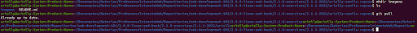
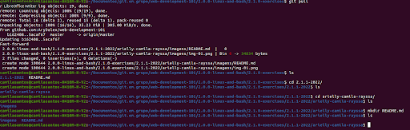
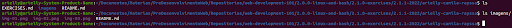
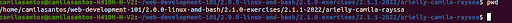
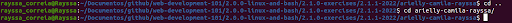
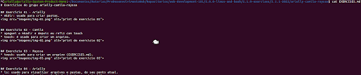
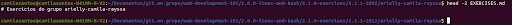
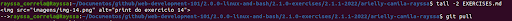

# Exercicios do grupo arielly-camila-rayssa

## Exercicio 01 - Arielly
* mkdir: usado para criar pastas.

## Exercicio 02 - Camila
* apaguei o mkadir e depois eu refiz com touch 
* touch: é usado para criar um arquivo.

## Exercicio 03 - Rayssa
* touch: usado para criar um arquivo (EXERCISES.md).

## Exercicio 04 - Arielly
* ls: usado para vizualizar arquivos e pastas, do seu ponto atual.

## Exercicio 05 - Camila
* pwd: usado para descobrir o caminho da pasta em que você está.

## Exercicio 06 - Rayssa
* cd: Para navegar pelos arquivos e diretórios

## Exercicio 07 - Arielly
* cat: usado para mostra (printar) no termanil linux, o conteúdo do arquivo desejado.

## Exercicio 08 - Camila
* head: usado para ver as primeiras linhas de qualquer arquivo de texto.

## Exercicio 09 - Rayssa
* tail: usado para ver as ultimas linhas de qualquer arquivo de texto.

## Exercicio 10 - Arielly
* coloquei ao decorrer dos exercicios.

## Exercicio 11 - Camila
* coloquei ao decorrer dos exercicios.

## Exercicio 12 - Rayssa
* coloquei ao decorrer dos exercicios.

## Exercicio 14 - Todos os membros
* usamos todos os comandos ao decorrer dos exercicios.
* OBS: execeto o 'echo'.