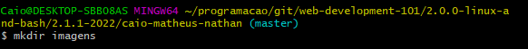
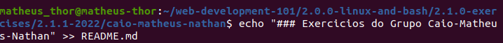
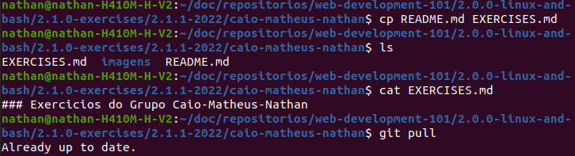
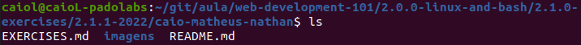
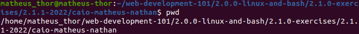
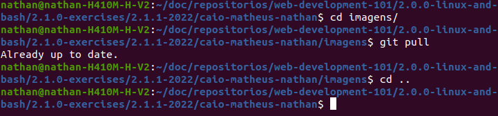
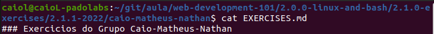
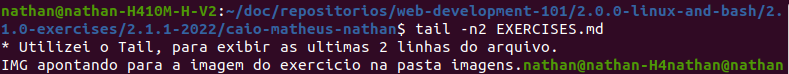

### Exercicios do Grupo Caio-Matheus-Nathan
---  

Exercicio 01 - Caio
* Usei o MKDIR para criar uma nova pasta.

Exercicio 02 - Matheus
* Usei o echo para criar um arquivo README.md.

Exercicio 03 - Nathan
* Utilizei o cp para copiar o README.md para EXERCISES.md.

Exercicio 04 - Caio
* Usei o comando LS para listar todos os arquivos do diretório.

Exercicio 05 - Matheus
* Usei o pwd para verificar o diretório de trabalho.

Exercicio 06 - Nathan
* Utilizei o cd para navegar pelos diretórios.

Exercicio 07 - Caio
* Usei o comando CAT para ler todo o arquivo.

Exercicio 08 - Matheus
* Usei o comando head para exibir as duas primeiras linhas do arquivo EXERCISES.md.

Exercicio 09 - Nathan
* Utilizei o Tail, para exibir as ultimas 2 linhas do arquivo.

