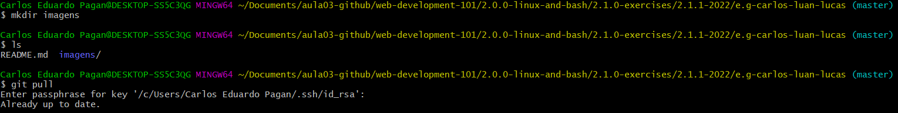

### Exercicios do Grupo Carlos-Luan-Lucas
---

Exercicio 01 - Carlos
* Comando: mkdir - Cria uma pasta. Ex: mkdir minha_pasta

Exercicio 04 - Carlos
* Comando: ls - Lista os arquivos dentro de um diretorio.

Exercicio 07 - Carlos
* Comando : cat - Lista o cunteudo de um ou mais arquivos. Ex: cat README.mc

	

